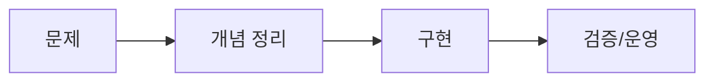

# PALDYN Tech Blog Post Template

````markdown
---
title: "제목"
description: "한 줄 요약"
author: "작성자 이름"
pubDate: 2026-04-19
type: "knowledge"          # "record" | "knowledge"
category: "AI"
tags: ["llm", "rag", "prompt"]
featured: false
draft: false
---


## TL;DR

- 핵심 요약 1
- 핵심 요약 2

## 핵심 키워드

- 키워드 A: 한 줄 정의
- 키워드 B: 한 줄 정의
- 키워드 C: 한 줄 정의

## 왜 중요한가

문제 맥락과 실무에서의 중요성을 설명합니다.

## 코드/도식

```ts
// 예시 코드
const summary = {
  includeImage: true,
  includeCodeOrDiagram: true,
};
````



## 실무 적용 체크리스트

- 체크포인트 1
- 체크포인트 2
- 체크포인트 3

## 마무리

다음 글로 이어질 주제를 한 줄로 정리합니다.
```

## Required Checklist

- 이미지 1개 이상 포함
- 코드/도식 블록 1개 이상 포함
- 키워드 섹션 포함
